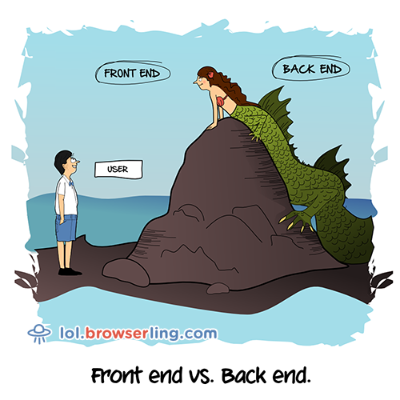
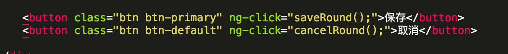
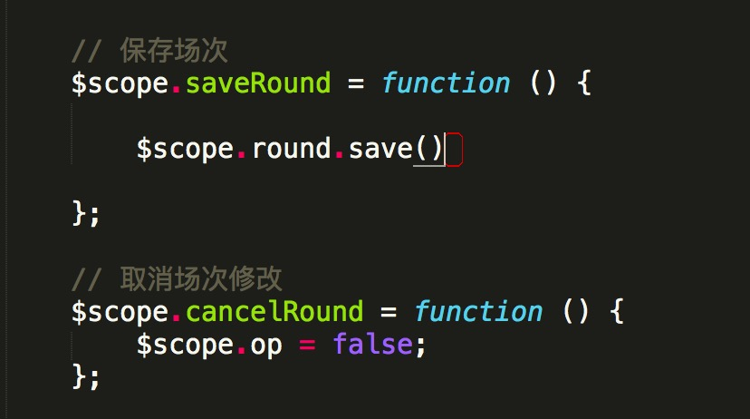

# FE 101
###  --- 从历史发展看前端
<br/>
<br/>

cloughzhang(张宇航)

2017-01-19

---

  - 什么是前端

  - web前端的发展史

  - web前端的问题

  - 框架与工具

---

## 什么是前端？

--
    
### 广义上讲
<!-- .element: class="fragment" data-fragment-index="1" -->


所有用户终端产品与视觉和交互有关的部分 <!-- .element: class="fragment" data-fragment-index="1" -->

  

--

### 狭义上来说

处理<b style="color: red;">浏览器</b>上的处理<b style="color: red;">视觉</b>和<b style="color: red;">交互</b>问题


--

### 视觉实现 ＋ 交互实现

### [页面重构] ＋ [页面交互 + 数据交互] <!-- .element: class="fragment" data-fragment-index="1" -->

### V + C + M <!-- .element: class="fragment" data-fragment-index="2" -->

### [HTML + CSS] + [(HTML + JS) + (HTTP)] <!-- .element: class="fragment" data-fragment-index="2" -->


### <b style="color: red;">[HTML + CSS] + [(HTML + ES + DOM + BOM) + (AJAX + HTTP)] + Browser + Tools </b> <!-- .element: class="fragment" data-fragment-index="3" -->

### HTML + CSS + JS + HTTP + Browser ＋ Tools <!-- .element: class="fragment" data-fragment-index="4" -->

--
### HTML 谦虚态度 夯实基础

  - 默认为inline, block的标签

  - script 的默认display属性

--
### JS 前端最重要本领、深度掌握

  - 变量提升问题
  
  - [] == ![]

--

```
var a = 0;
function foo() {
  console.log(a);
  var a = 1;
}
foo();
```
--
### HTTP 工程化思想

 - 200 VS 304

 - 301 VS 302 

--
### CSS 创新思维

 - 用CSS画一个带边框的三角形

--

### Browser 前端经验 
  
 - 浏览器的userAgent

 - 同源策略／click-jacking

--

### TOOLS 知识广度

  - 框架

  - 类库

  - 构建工具

    - npm scripts, webpack, gulp, grunt

  - 其他工具
    
    － 调试工具、抓包工具、编辑器、图像处理工具等 

  - 真阿当 VS 尤小佑
  
---

## 前端历史

--

### HTML的产生

 - 1989, Tim Berners-Lee（B.L. Tim）

 - 共享文档需要

 - 浏览器、服务器、HTTP

 - WWW浏览器（NEXUS）发布 


--

### HTML 1.0

 - 1991	

 - 标签

   - NEXTID, ISINDEX 

   - TITLE, PLAINTEXT

   - <b style="color: red;">A</b>, P, H1, H2, H3, H4, H5, H6, ADDRESS

   - DL, DT, DD, UL, LI,

 - 格式

   - 语义化

   - 样式 
-- 

### HTML 2.0

 - 1994, IETF

 - 更多的标签 

   - HTML, HEAD, BODY

   - A, P, H1, H2, H3, H4, H5, H6, ADDRESS

   - DL, DT, DD, UL, OL, LI, DIR, MENU

   - <b style="color: red;">FORM</b>, INPUT, SELECT, OPTION, TEXTAREA

   - IMG, EM, STRONG, B, I, CITE

   - ...

--

## 如果没有AJAX，如何实现局部刷新

--
### HTML 3.2

 - 1997, W3C

 - Netscape 引入私有标签

 - HTML 3.X 失败

 - W3C接管HTML标准化工作

--

### HTML 4.01

 - 1998, W3C

 - CSS 2.0

 - <!DOCTYPE HTML PUBLIC "-//W3C//DTD HTML 4.01//EN" "http://www.w3.org/TR/html4/strict.dtd">

 - <b style="color: red;">样式内容分离</b>，CSS支持

 - 渲染模式（DOCTYPE）

   - 怪异模式

   - 准标准模式

   - 标准模式

--  

### XHTML 1.0

 - 2000

 - 用XML语法重新定义HTML

 - 语法严格

--  
### XHTML 2.0

 - 不兼容历史

 - 去除了样式类标签

 - 去除img, a

 - 彻底修改Form

 - 开发者不欢迎，浏览器不支持

--  

### HTML 5

 - 2004, WHATWG继续发展HTML

 - 2008, 发布草案

 - 设计思想
  
  - 兼容已有内容，优雅降级，尊重事实标准

  - 避免复杂性

  - 解决现实问题 

  - <b style="color: red;">用户 -> 开发者 -> 浏览器厂商 -> 标准制定</b>

--

### HTML 5变化

 - 语义标签和属性，去除纯展示标签

 - canvas，video，audio，离线，本地存储，拖拽

 - 语法更不严格

--  

 - 1989，HTML、HTTP、Browser 诞生，
 
 - 1990，HTTP 0.9发布 （只支持GET方法，响应中携带的消息必须HTML文件）

 - 1991，HTML 1.0发布

--
 - 1993，Mosaic 

 - 1994，NetScape／(Mozilla) 浏览器一战爆发

 - 1994，HTML 2.0发布

 - 1994，CSS被提出 (table 布局／div+css布局)

 - 1995，JS 1.0发布 (Netscape Navigator 2.0, Brendan Eich)

--
 - 1995，IE

 - 1996，OPERA

 - 1996，CSS 1.0发布

 - 1996，HTTP 1.0发布

 - 1997，HTML 3.2废弃

 - 1997，JS 1.1发布，更名为ES 1.0发布, ECMA

--
 - 1997，DHTML（Dynamic HTML，动态HTML）DOM标准发布

 - 1998，HTML 4.1 W3C发布

 - 1998，CSS 2.0发布

 - 1998，ES 2.0发布
 
 - 1998，Netscape成立Mozilla开源项目，最终以IE获胜结束
 
 - 1999，ES 3.0发布

 - 1999，IE 5部署了XMLHttpRequest接口

 - 1999，HTTP 1.1发布

--
 - 2000，XHTML1.0发布
 
 - 2000，KDE项目重写了浏览器引擎KHTML，为后来的WebKit和Blink引擎打下基础

 - 2001，IE 6

 - 2001，Douglas Crockford提出了JSON格式，用于取代XML格式

 - 2003，XHTML 2.0废弃

--

 - 2003，Safari 浏览器二战爆发

 - 2004，Mozilla 发布 Firefox

 - 2004，WHATWG继续发展HTML

 - 2006，IE7

 - 2008，Chrome

--
 - 2008，HTML5草案发布

 - 2008，ES 4.0 废弃, 更改为 ES 3.1, 再次更改为 ES5.0

 - 2013，HTTP2.0 首次合作共事性测试

 - 2015，ES 6发布，更名为ES2015

 - 2016，更名为ES2017

---


## 前端工业化问题

 - 前后端分离 <!-- .element: class="fragment" data-fragment-index="1" -->
 
 - 前端性能优化 -- 缓存问题 <!-- .element: class="fragment" data-fragment-index="2" -->

 - 代码组织(MVC、MVP、MVVM) <!-- .element: class="fragment" data-fragment-index="3" -->

 - 框架和工具 <!-- .element: class="fragment" data-fragment-index="4" -->

--

## 前后端分离

 - 前端先开发静态页面，后端套页面

 - 前端写html，用ajax拉取数据(SPA)

 - 前端写模板，后端拉取模板

 - 前端写模板，后端通过通信协议拉取模板

 - 前端接管路由，请求后端数据


--

## 前端性能优化

### 从两道面试题讲起

- yahoo的14条军规

--

## 前端缓存

- 本地缓存

  - cache-control & expires

- 协商缓存
  
  - ETag/If-Non-Match & Last-Modified

--

## 如何应用缓存？

--
  - 文档资源（html）

  - 静态资源

  - 动态数据

--

## 静态资源的缓存更新策略

  - 时间戳

  - 文件md5

--

## 代码组织

- 开发效率 & 可维护性

- constraints over conventions

--
```
  <!DOCTYPE html>
  <html>
  <head>
    <title></title>
  </head>
  <body>
    <div id="test">Hello, world</div>
  </body>
  </html>
```

--
``` 
  // vallina JS
  document.getElementById('text').innerHTML = 'Hello, cloughzhang'
  document.getElementById('text').onclick = function () {
    alert(1)
  }
```
--
```
    // jQuery
    $('#text').text('Hello, cloughzhang')
    $('#text').click(function () {
      alert('cloughzhang')
    });
```
--
```
    // BackBone MVC
    <div id="test">Hello, <%= name %></div>

    _.template('#test', {name: 'world'});

    '#test click': 'clickHandler',    
    clickHandler: function () {
      _.template('#test', {name: 'cloughzhang'});
    }
```
--
```
    // Backbone MVVM
    this.model = {name: 'world'};
    ...
    render: function () {
      _.template('body', this.model);
    }
    this.model.onchange(function () {
      this.render();
    })
    ...
    '#test click': 'clickHandler',    
    clickHandler: function () {
      this.model.set('name', 'cloughzhang');
    }
```
--

```
    // Angular MVVM
    <div ng-click="clickHandler()">Hello, {{name}}</div>

    $scope.name = 'world';
    $scope.clickHandler = function () {
      $scope.name = 'cloughzhang'
    }
    ...

```

--

## 组件化与MVVM

-- 

### MVVM VS MVC(MVP)
--
### MVC


--
### MVP


--
### MVVM


--
 - M -> V 
  - DOM操作 MVC（模板渲染）
  - 双向绑定 MVVM
 - V -> M 事件绑定  
  - Controller上绑定 MVC
  - DOM上绑定  MVVM
--
 - M -> V 
  - DOM操作 MVC（模板渲染）
  - 双向绑定 MVVM
--

 - M -> V 
  - DOM操作 MVC
  
--

 - M -> V
  - 双向绑定 MVVM
    
--
 
### 举例： loading
 - MVC： 
  1. js生成loading的dom；
  2. 把loading的dom append到body上；
  3. 不需要的时候remove掉。
 - MVVM：
  1. 事先写好loading的模板加入html中；
  2. 将设置loading页面display的属性绑定到 data的loadingShow的属性上；
  3. 需要loading的时候将，data.loadingShow设为true,其余时候设为false。
-- 
 - V -> M 事件绑定  
  - Controller上绑定 MVC
  - DOM上绑定  MVVM
-- 
 - V -> M 事件绑定  
  - Controller上绑定 MVC
    
--
 - V -> M 事件绑定 
  - DOM上绑定MVVM  
  
  
--
### Model层并不相同

 - M in MVC: 后端数据
 - M in MVVM: 后端数据 ＋ Views状态
 
-- 
### 重点层

 - C层厚，M层薄 V->C->M->C->V
 - M层厚，无C层 一切方法都应该是数据的 
--
### 组件化
 
MVC
 - 方法调用
 - 事件透传
 
MVVM
 - 数据绑定
--
MVVM 组件化举例

MultiChoice
  

--- 

## 前端框架

- Vallina.js

- jQuery.js

- Ext.js

- Backbone.js

- Angular.js

- React.js, Vue.js(2.0), Angular.js(2.0), Polymer.js

--

## 前端工具

--

## 本地工程化构建工具


Grunt - Gulp - Webpack - Npm Scripts


<small>(npm、grunt、gulp插件个数对比 － 2016.05)</small>

--


---
## Q & A


