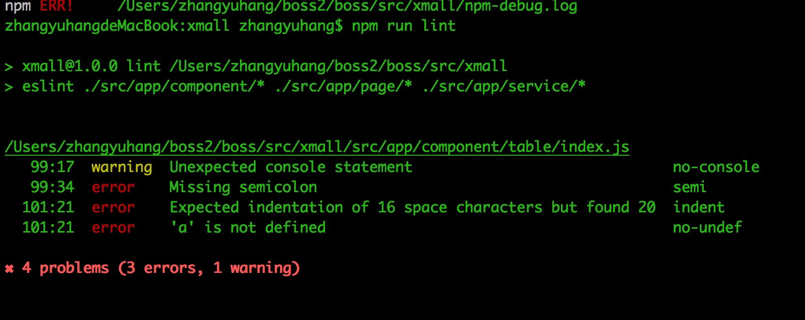
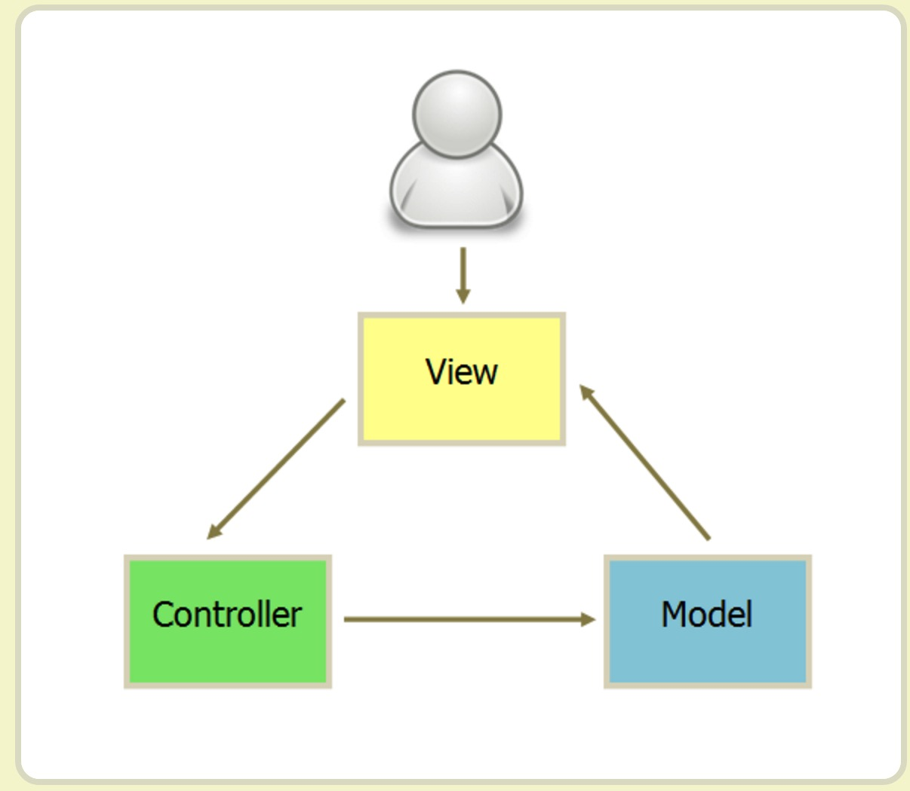
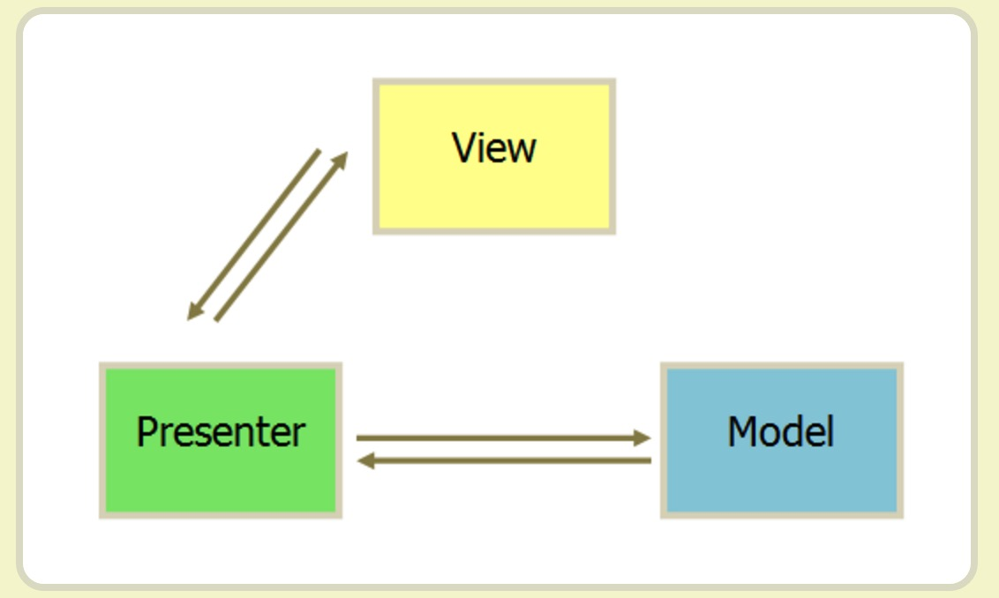
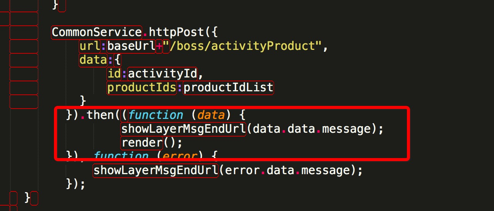
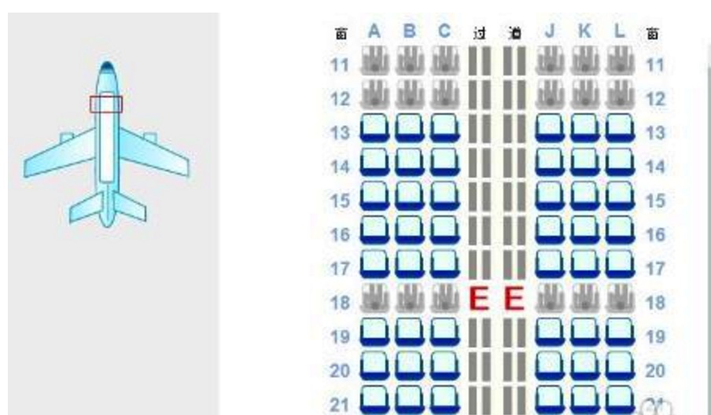
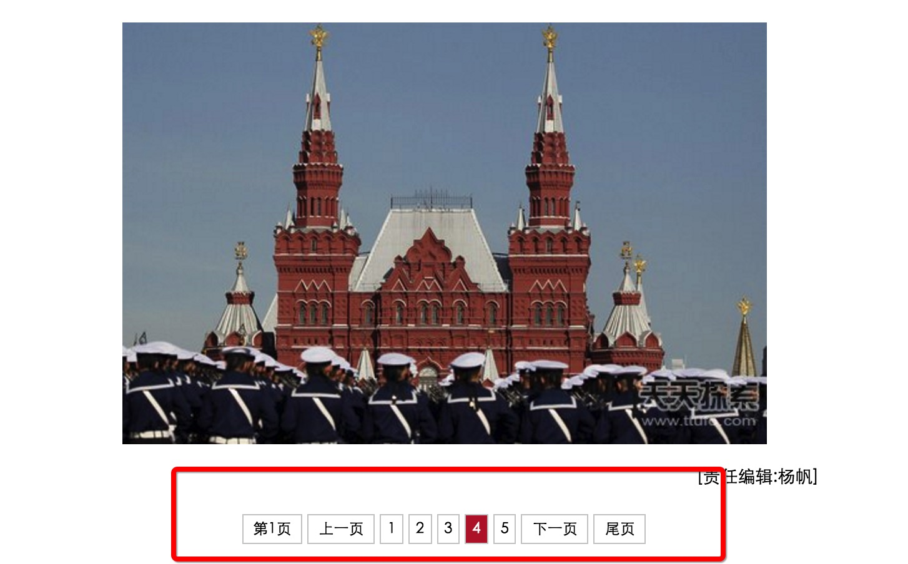
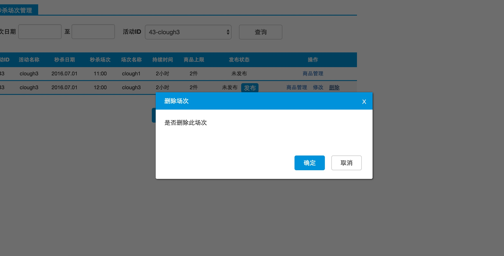
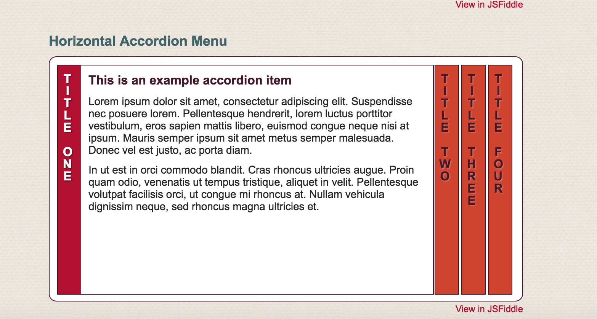
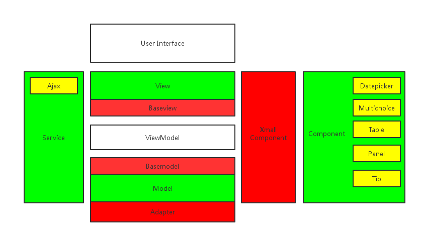

# 直采商城BOSS侧  前端技术分享


cloughzhang(张宇航)

2016-07-18


---

## 技术回顾－> 业务分析－> 技术改进


--

### XMALL 1.0 技术回顾


 - 本地工程化构建
	
 - 组件化与MVVM
	
 - label for的奇技淫巧
		
		
-- 

### XMALL BOSS侧业务特点分析

 - 业务特点
	
 - 前端难点

--

### XMALL 2.0 技术规划

	
 - 工厂模式的引入
	
 - 数据管理
	
 - 进一步组件化的思考


---


## 直采商城BOSS侧 项目背景介绍

 - 重逻辑、重交互（但具有统一性）、轻视觉
 - 数据层（M层）复杂、控制层（C层）复杂，但可以抽象、V层简单

--

## EXTJS的缺点

 - 样式丑、且定制化差
 - API复杂、学习曲线复杂
 

---
## 理想中的框架
 - 只需要关注业务即可
 - 只需要关注逻辑（数据）即可
 - 支持定制化、拓展性要好
 - 降低学习曲线

---
## BOSS-XMALL 1.0 技术回顾


---


## 本地工程化构建

Webpack + Npm Scripts<!-- .element: class="fragment" data-fragment-index="1" -->

-- 

Grunt - Gulp - Webpack - Npm Scripts


<small>(npm、grunt、gulp插件个数对比 － 2016.05)</small>

--

<small>

[我为何放弃Gulp与Grunt，转投npm scripts（上）](http://www.infoq.com/cn/news/2016/02/gulp-grunt-npm-scripts-part1)

[我为何放弃Gulp与Grunt，转投npm scripts（中）](http://www.infoq.com/cn/news/2016/02/gulp-grunt-npm-scripts-part2)

[我为何放弃Gulp与Grunt，转投npm scripts（下）](http://www.infoq.com/cn/news/2016/02/gulp-grunt-npm-scripts-part3)

</small>
--

### Webpack重要概念

 - entry
 
 - output

 - modules - loaders
 
 - plugins
 
 - resolve
 
 - externals

--

### entry

	entry: "./entry.js"

	entry: ["./entry1.js", "./entry2.js"]
	
	entry: {
	    page1: "./page1",
    	page2: ["./entry1", "./entry2"]
	},
	
	entry: {
    	vendor: ["angular", "moment"]
	},
--

### output

```
    output: {
        path: __dirname + '/local/app/',
        filename: '[name].[chunkhash].js'
    },
```
--

### loaders

	module: {
        loaders: [{
            test: /\.scss$/,
            loader: ExtractTextPlugin.extract('style', 'css!sass')
        }, {
            test: /\.less$/,
            loaders: ['style',  'css', 'less']
        },             
        {
        	test: /\.jsx?$/,
        	exclude: /(node_modules|bower_components)/,
        	loader: 'babel?presets[]=es2015'
        },{
            test: /\.(gif|png|jpe?p)$/,
            loader: 'url-loader',
            query: {
                limit: 8192,
                name: '[name]-[hash].[ext]'
            }
        }, {
            test: /template\.html$/,
            loader: 'ngtemplate?relativeTo=' + (path.resolve(__dirname, './src/app')) + '/!html'
        }, {
            test: /\.(gif|png|jpe?p)$/,
            loader: 'file-loader'
        }]
	}
-- 
### plugins


	plugins: [
		new CleanWebpackPlugin(['local'], {
			root: __dirname,
			verbose: true,
			dry: false
		}),

		new WebpackMd5Hash(),

		new ExtractTextPlugin('[name].[contenthash].css', {
			disable: false,
			allChunks: true
		}),

		new CopyWebpackPlugin([{
			from: './src/app/lib/',
			to: './lib/'
		}]),

		new XMallHtml({
			distPath: __dirname + '/local/html/',
			srcPath: __dirname + '/src/views/',
			cdnHost: ''
		}),
		
		new WebpackSftpClient({
			port: '22',
			host: '10.24.248.184',
			username: 'root',
			password: 'froad123!@#',
			path: './local/',
			remotePath: '/data/website/admin/boss/xmall/'
		}),
	
		new OpenBrowserPlugin({
			url: 'http://localhost:' + port + '/html/sample.html'
		})
   
   
-- 

### Gulp Plugin VS Webpack Plugin


--
### Others

	resolve: {
		extensions: ['', '.js', '.json', '.scss', '.html']
	},

	devtool: 'sourcemap',

	externals: {
		jquery: 'jQuery',
		angular: 'angular',
		moment: 'moment'
	}

--
在项目中的应用


--
### Npm Scripts

```
  "scripts": {
    "local": "webpack --env local --watch --progress --watch",
    "dev": "webpack --env dev --progress",
    "test": "webpack --env test --progress",
    "dist": "webpack --env dist --progress",
    "lint": "eslint ./src/app/component/* ./src/app/page/* ./src/app/service/*",
    "git": "npm run lint && git add -A && git commit -m",
    "changelog": "conventional-changelog -p angular -i CHANGELOG.md -s -r 0"
  },
```

-- 

 - ghooks
 
 - eslint
 
 -  参数 --
 
 - prebuild、build、postbuild
 
 - npm start、npm test
 
 - changelog
 
--

### ghooks
```
  "config": {
    "ghooks": {
      "commit-msg": "node validate-commit-msg.js"
    },
    "validate-commit-msg": {
      "project": [
        "MALL"
      ],
      "types": [
        "feat",
        "fix",
        "docs",
        "style",
        "refactor",
        "perf",
        "test",
        "chore",
        "revert"
      ],
      "warnOnFail": false,
      "maxSubjectLength": 100
    }
  },
```
-- 
### ghooks


--
### CHANGELOG


--

### eslint 


--


### eslint 



--

### git submodule的引入
---

## 组件化与MVVM

-- 

### MVVM VS MVC(MVP)
--
### MVC


--
### MVP


--
### MVVM


--
 - M -> V 
 	- DOM操作 MVC（模板渲染）
 	- 双向绑定 MVVM
 - V -> M 事件绑定  
 	- Controller上绑定 MVC
 	- DOM上绑定  MVVM
--
 - M -> V 
 	- DOM操作 MVC（模板渲染）
 	- 双向绑定 MVVM
--

 - M -> V 
 	- DOM操作 MVC
 	
--

 - M -> V
 	- 双向绑定 MVVM
  	
--
 
### 举例： loading
 - MVC： 
 	1. js生成loading的dom；
 	2. 把loading的dom append到body上；
 	3. 不需要的时候remove掉。
 - MVVM：
 	1. 事先写好loading的模板加入html中；
 	2. 将设置loading页面display的属性绑定到 data的loadingShow的属性上；
 	3. 需要loading的时候将，data.loadingShow设为true,其余时候设为false。
-- 
 - V -> M 事件绑定  
 	- Controller上绑定 MVC
 	- DOM上绑定  MVVM
-- 
 - V -> M 事件绑定  
 	- Controller上绑定 MVC
 	 	
--
 - V -> M 事件绑定 
 	- DOM上绑定MVVM 	
 	
 	
--
### Model层并不相同

 - M in MVC: 后端数据
 - M in MVVM: 后端数据 ＋ Views状态
 
-- 
### 重点层

 - C层厚，M层薄 V->C->M->C->V
 - M层厚，无C层 一切方法都应该是数据的 
--
### 组件化
 
MVC
 - 方法调用
 - 事件透传
 
MVVM
 - 数据绑定
--
MVVM 组件化举例

MultiChoice
 	

--- 
	
### label for的奇技淫巧
[You Don't Need JavaScript](https://github.com/NamPNQ/You-Dont-Need-Javascript)

--

### MultiChoice

--
### 选座系统

--
### Tab

[Tab Demo](https://codepen.io/llgruff/pen/ZGBxOa)


--
### Pagination

--
### Modal (Panel)

--
### Slider

--
### Vertical Accordion Menu

[http://www.mraffaele.com/labs/css-only-accordions/](http://www.mraffaele.com/labs/css-only-accordions/)

--
### 进一步思考

label for ＋ radio | checkbox  ==  click in JS ?<!-- .element: class="fragment" data-fragment-index="1" -->


--

### 其它

 - 锚点
 - before / after
 - counter

---

### XMALL BOSS侧业务特点分析

--
### 业务特点

 - 界面交互、视觉统一化 
 	 
 	 - 可以进一步抽象化、组件化<!-- .element: class="fragment" data-fragment-index="1" -->
 	 
 - 不需要兼容IE       
 	 
 	 - 可以使用浏览器高级特性，全面拥抱HTML5 & ES6<!-- .element: class="fragment" data-fragment-index="2" -->
 	 
 	 

 
-- 
### 前端难点

 - 业务较为复杂： 接口变动较大、前端接管部分逻辑  
 	- 处理数据层 <!-- .element: class="fragment" data-fragment-index="1" -->

 - 交互复杂   
 	- 组件化处理复杂交互<!-- .element: class="fragment" data-fragment-index="2" -->

 
 
---

### BOSS－XMALL 2.0 技术规划



---

### 引入工厂模式

Baseviews & BaseModel
--

### Base View

--
### Base View

--
### Base View

--
### Base View

--
### Base View

--

### Type One

 - condition
 - table
 - operation
--
### Code


--
### 如何实现

- 构建工具（head、tail）
- 业务型组件（condition、table、buttons、operation）

--


### Base Model

 - Data: $scope.head, $scope.tail, $scope.condition, $scope.table, $scope.buttons, $scope.operation, $scope.panel, $scope.tip
 
 - Method: $scope.condition.search(), $scope.tip.show();
 
 - extend

---
### 缺点
 - 定制化较差
 - 由于组件的抽象导致 不够MVVM


---
### 引入数据管理


--

### 引入数据管理

Adapter

---
	
### 进一步组件化的思考


inherence OR Composition OR Repeat?

---

## Q & A


