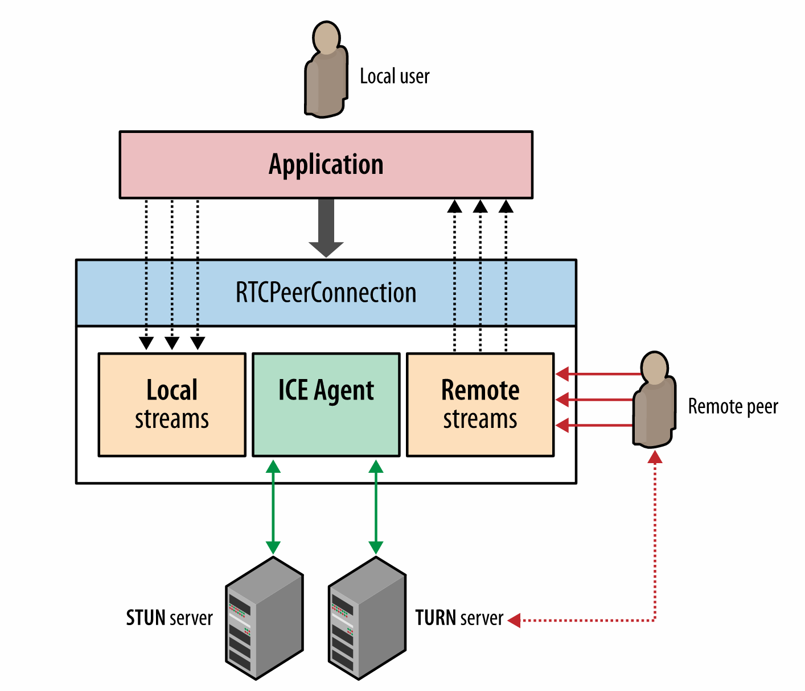

# 七牛视频直播学习笔记

## 一、《视频直播技术详解》系列之一：开篇

参考:
[《视频直播技术详解》系列之一：开篇](http://blog.qiniu.com/archives/6606)

### 1. 主要流程

原作者给的流程图：

#### 1.1 采集

- iOS 系统因为软硬件种类不多，硬件适配性较好，所以比较简单。
- Android 则不同，市面上硬件机型非常多，难以做到一个库适配所有硬件。
- PC 端的采集也跟各种摄像头驱动有关，推荐使用目前市面上最好用的 PC 端开源免费软件 OBS。

#### 1.2 处理

- 视频处理如模糊效果、水印等也都是在这个环节做。
- iOS 端比较知名的是 GPUImage 这个库，提供了丰富端预处理效果，还可以基于这个库自己写算法实现更丰富端效果。
- Android 也有 GPUImage 这个库的移植，叫做 android-gpuimage。同时，Google 官方开源了一个伟大的库，覆盖了 Android 上面很多多媒体和图形图像相关的处理。(啥库？没说啊。。。)

#### 1.3 编码
- 处理硬件兼容性问题。（硬件兼容性？不懂。。。）
- 在高 fps、低 bitrate 和音质画质之间找到平衡。
	- iOS 端硬件兼容性较好，可以直接采用硬编。
	- Android 的硬编的支持则难得多，需要支持各种硬件机型，推荐使用软编。
	
#### 1.4 推流和传输

- 从主播端到服务端，从收流服务端到边缘节点，以及再从边缘节点到观众端。
- 推流端和分发端理论上需要支持的并发用户数应该都是亿级的，
	- 不过毕竟产生内容的推流端在少数对推流稳定性和速度的要求比播放端高很多
- 现在的CDN不靠谱 
	- 你能够借助CDN快速实现大规模的流分发
	- 但是稳定高速的推流上传可能还需要自己做很多工作
	- 七牛打造了一个直播专属的实时流网络
	
#### 1.5 转码

- 转码成不同格式支持不同协议如 RTMP、HLS 和 FLV，一路转多路流来适配各种不同的网络状况和不同分辨率的终端设备。
- 内容识别，如：鉴黄功能。

#### 1.6 解码和渲染

- iOS 端的播放兼容性较好，在延迟可接受的情况下使用 HLS 协议是最好的选择 + RTMP 和 HLS 的播放器 SDK。
- Android 的硬件解码和编码一样也存在兼容性问题，目前比较好的开源播放器是基于 ffplay 的 ijkplayer + Android SDK。

#### 1.7 直播场景化解决方案

- 社交直播下的聊天、点赞和弹幕的支持

## 二、《视频直播技术详解》系列之二：采集

参考:
[《视频直播技术详解》系列之二：采集](http://blog.qiniu.com/archives/6713)

### 1. 采集内容

#### 1.1 音频采集

- 模拟信号 －> PCM编码的原始数据（模拟变数字，采样、量化、编码） －> 压缩数据
- 常见的音频压缩格式有：MP3，AAC，OGG，WMA，Opus，FLAC，APE，m4a 和 AMR 等。
- 挑战: 延时敏感、卡顿敏感、噪声消除（Denoise）、回声消除（AEC）、静音检测（VAD）和各种混音算法等。(这些是什么？需要好好恶补一下。。。)
- 技术参数
	- 采样率
	- 位宽：量化（16bit/32bit）
	- 声道数: 录制时的音源数量或回放时相应的扬声器数量
	- 音频帧: 音频数据是流式的，本身没有明确的一帧帧的概念。一般约定为2.5ms~60ms
	- size ＝ 采样率（kHz）X 位宽（bit）X 声道数 X 帧长（ms）
 
#### 1.2 图像采集

- 摄像头等设备拍摄成 YUV 编码的原始数据 -> 编码压缩成 H.264 等格式
- 常见的视频封装格式有：MP4、3GP、AVI、MKV、WMV、MPG、VOB、FLV、SWF、MOV、RMVB 和 WebM
- 挑战: 设备兼容性差、延时敏感、卡顿敏感以及各种对图像的处理操作如美颜和水印等。
- 技术参数
	- 图像传输格式: 通用影像传输格式（Common Intermediate Format）是视讯会议（video conference）中常使用的影像传输格式。
	- 图像格式: 通常采用 YUV 格式存储原始数据信息，其中包含用 8 位表示的黑白图像灰度值，以及可由 RGB 三种色彩组合成的彩色图像。
	- 传输通道: 正常情况下只需1路通道，随着VR和AR技术的日渐成熟，为了拍摄一个完整的 360° 视频，可能需要通过不同角度拍摄，然后经过多通道传输后合成。
	- 分辨率: 视频采集卡能支持的最大点阵反映了其分辨率的性能。
	- 采样频率: 采样频率反映了采集卡处理图像的速度和能力。在进行高度图像采集时，需要注意采集卡的采样频率是否满足要求。
- 实际开发过程中可能很少能够关注采集环节中技术参数的控制，而是直接在 SDK 中将采集后的数据传递给下一个「处理」和「编码」环节。

### 2. 采集源

#### 2.1 摄像头采集
- 手机上 ios/Android（>4.0.3） 前后摄像头
- 专业摄像头：七牛云提供了兼容适合嵌入式系统的C语言采集模块的实现[https://github.com/pili-engineering/ipcam_sdk](https://github.com/pili-engineering/ipcam_sdk)（啥意思？驱动？or 接口？）

#### 2.2 屏幕录制
- iOS 9 以上的版本: 通过模拟一个 AirPlay 镜像连接到（当前 App）自身。
- Android SDK: 实现了屏幕录制的功能
- 电脑桌面: 开源的桌面推流工具 OBS 来进行屏幕录制和推流：[https://obsproject.com/](https://obsproject.com/)

#### 2.3 视频文件
- 将一个视频或者音频文件以直播流的形式实时传输

#### 2.4 开放式设计（接口）
- 只要采集源实现方遵循相应的接口，即可支持任意的采集源。

## 三、《视频直播技术详解》系列之三：处理
参考:
[《视频直播技术详解》系列之三：处理](http://blog.qiniu.com/archives/6795)

### 1. 开放式设计

- 音频处理中具体包含混音、降噪和声音特效
- 视频处理中包含美颜、水印、以及各种自定义滤镜
- 自定义处理
	- [iOS SDK](https://github.com/pili-engineering/PLMediaStreamingKit)
	- [Android SDK](https://github.com/pili-engineering/PLDroidMediaStreaming)

### 2. 美颜

- 主要原理: "磨皮"+"美白"
- 磨皮: 去躁。对图像中的噪点进行去除或者模糊化处理，常见的去噪算法有均值模糊、高斯模糊和中值滤波 + 人脸和皮肤检测技术。
- 美颜接口(ios SDK)：
	- 按照默认参数开启或关闭美颜:
		-(void)setBeautifyModeOn:(BOOL)beautifyModeOn;
	- 设置美颜程度，范围为 0 ~ 1:
		-(void)setBeautify:(CGFloat)beautify;
	- 设置美白程度，范围为 0 ~ 1:
		-(void)setWhiten:(CGFloat)whiten;
	- 设置红润程度，范围为 0 ~ 1:
		-(void)setRedden:(CGFloat)redden; 

### 3. 视频内嵌水印
- 水印功能接口(ios SDK)
	- 添加水印: 
		-(void)setWaterMarkWithImage:(UIImage *)wateMarkImage position:(CGPoint)position;
	- 移除水印:
		-(void)clearWaterMark; 
		
### 4. 滤镜
-  iOS 端可以考虑使用[GPUImage](https://github.com/BradLarson/GPUImage)这个库。内置了多达120多种常见的滤镜效果。 
-  Android 
	- 也有[GPUImage](https://github.com/CyberAgent/android-gpuimage)这个库的移植
	- Google 官方也开源了一个伟大的库[https://github.com/google/grafika](https://github.com/google/grafika) 
	
### 5. 连麦

- 技术难点:
	- 低延迟互动
	- 音画同步
	- 视频实时合成: 需要在客户端或者服务端将画面和声音实时合成，然后以低成本高品质的方式传输观众端
- 思科或者 WebEx 的商用方案: 一不开源，二比较封闭，三成本比较高
- WebRTC
	- 通过 RTCPeerConnection API 管理，这个 API 包装了底层流管理和信令控制相关的细节
		
	- 可以每个点之间形成自组织网络的方式通信;也可以以 1 人为中心形成星型通信网络;还可以让大家都通过一个集中式的服务端进行通信。
	
		
	- 七牛直播云经过评估选择了以主播为中心形成星形通信网络，支持主播和多个观众之间的互动质量。
	
	- 同时，为了保证合成后的音视频实时传输到其他观众端，这里采用经过改造的 UDP 协议传输：
		- 通过 UDP 降低传输延迟。
		- 在 UDP 之上进行传输控制，保证用户互动体验 QoS。
		
## 四、《视频直播技术详解》之四：编码和封装
	
参考:
[《视频直播技术详解》之四：编码和封装](http://blog.qiniu.com/archives/6816)

## 五、《视频直播技术详解》系列之五：推流和传输
	
参考:
[《视频直播技术详解》系列之五：推流和传输](http://blog.qiniu.com/archives/6914)

## 六、《视频直播技术详解》系列之六：延迟优化
	
参考:
[《视频直播技术详解》系列之六：延迟优化](http://blog.qiniu.com/archives/6996)

## 七、《视频直播技术详解》系列之七：现代播放器原理
	
参考:
[《视频直播技术详解》系列之七：现代播放器原理](http://blog.qiniu.com/archives/7040)
